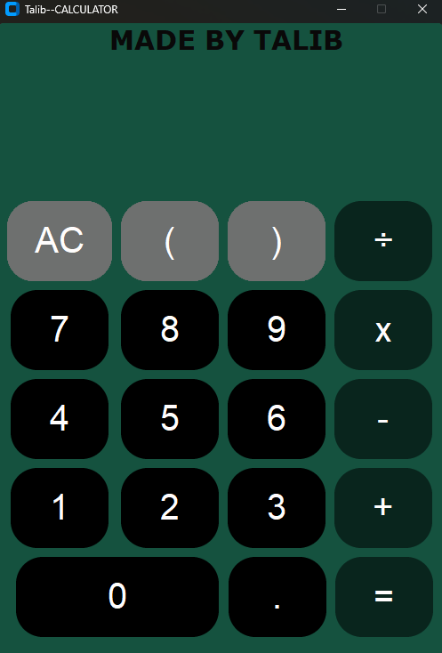

#Talib SIMPLE GUI CALCULATOR (CustomTkinter)

A modern, stylish desktop calculator application built
using **Python** and **CustomTkinter**.
This project provides a clean UI with basic arithmetic operations, bracket handling,
and real-time expression evaluation.

--------------------------------------

## Features
- Modern GUI using **CustomTkinter**
- Basic arithmetic operations
    - Addition (+)
    - Substraction (-)
    - Multiplication (x)
    - Division (÷)
- Supports brackets `( )` for expressions
- Decimal number support
- **AC (ALL Clear)** button
- Error handling for invalid expressions
- Clean dark-themed UI
- Button-based input (no keyboard needed)

---------------------------------------

## Preview
<p aling="center">
    
</p>
---------------------------------------
## Technologies Used
- Python 3
- CustomTkinter 
    (Modern UI wrapper for Tkinter)

----------------------------------------
## Installation & Run

### 1. Clone the repositry
```bash
git clone https://github.com/TALIBKHAN-hub/SIMPLE---GUI---CALCULATOR.git
cd SIMPLE---GUI---CALCULATOR
```

### 2. Install dependencies
```bash
pip install customtkinter
```

### 3. Run the application
```bash
python Calculator.py
```

----------------------------------------
## HOW IT WORKS:
- Button clicks append values to a string (`num_data`)
- Expression is evaluated using Python's `eval()` function
- Brackets are calculated first, then replaced into the main expression
- Results is in displayed in a label widget
- Errors are safely handled and shown as `ERROR`

----------------------------------------
## NOTE:
- This project use `eval()` for simplicity
- Recomended only for learning purposes, not for production environments

-----------------------------------------
## AUTHOR:
### MADE BY TALIB

-----------------------------------------
## LICENSE:
- This project is free to use,modify, and share

-----------------------------------------
## SUPPORT:
if you like this project:
- Star the Repository
- Fork it
- Share it with others